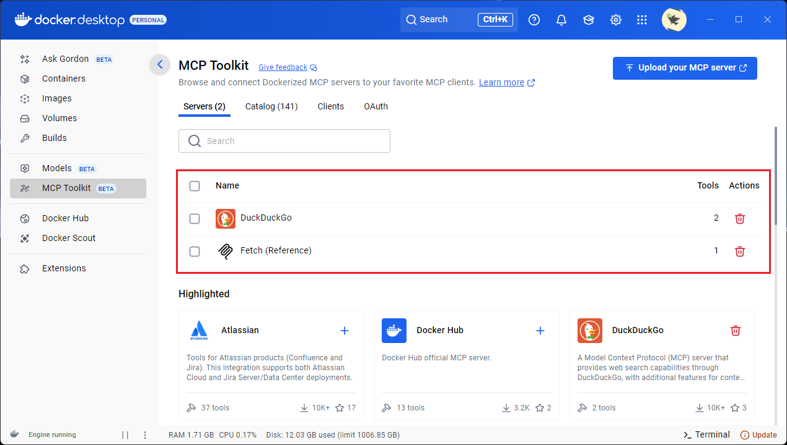
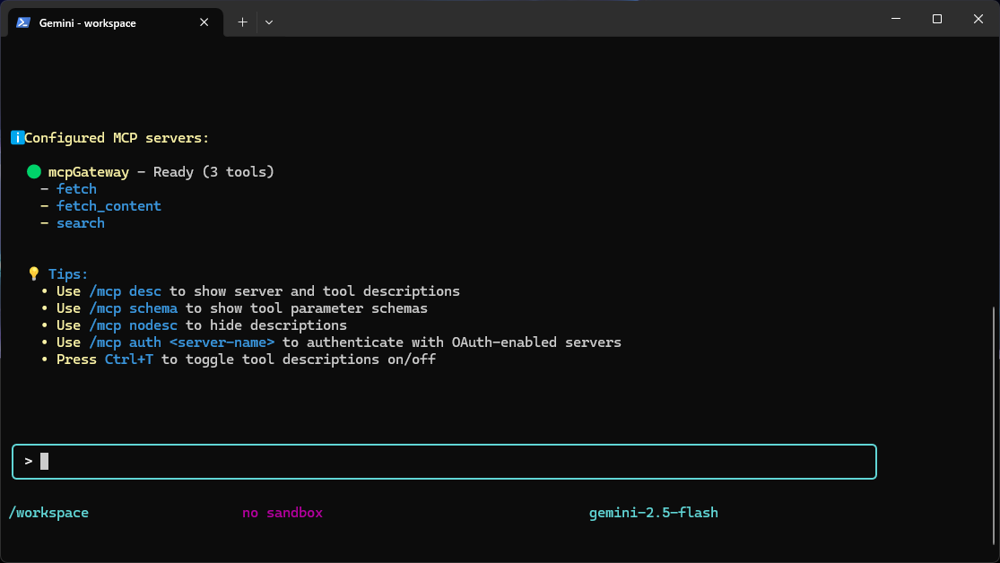
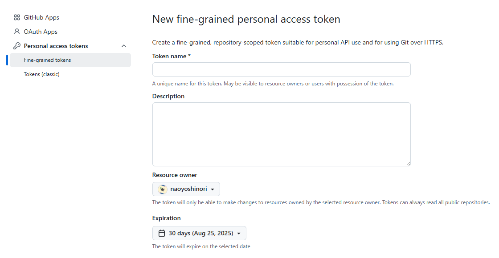
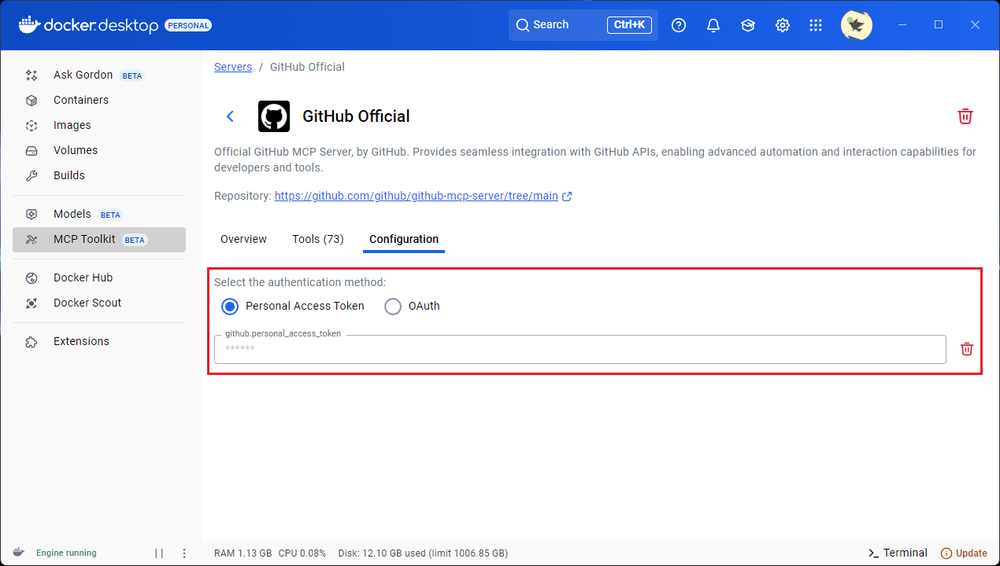
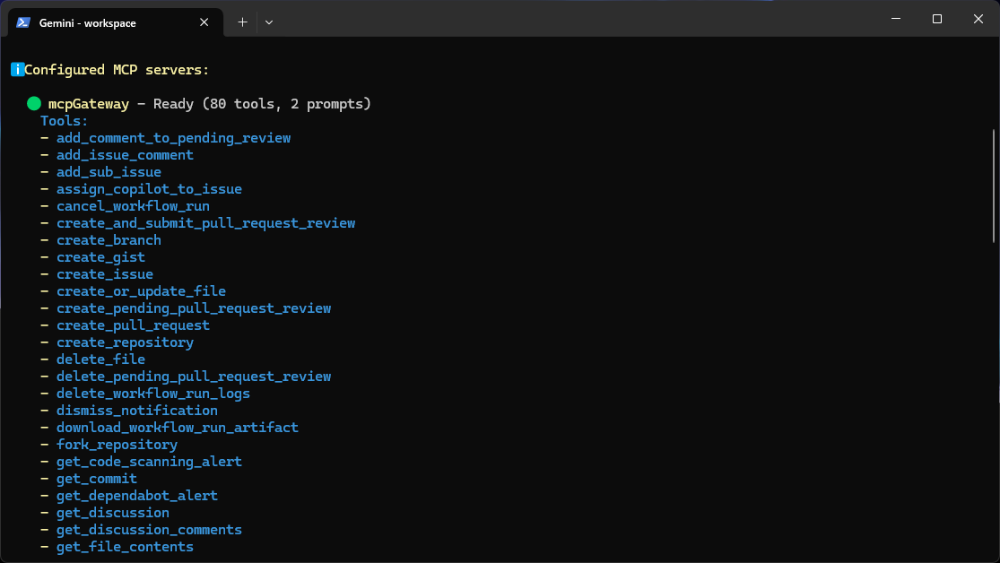

# Using the Gemini CLI with Docker MCP Gateway via Docker Compose

This example demonstrates how to use the Gemini CLI with a Docker MCP Gateway using Docker Compose.

The Docker MCP Gateway allows you to securely expose local and containerized tools to AI models. For more detailed information about the gateway itself, please refer to the official [Docker documentation](https://docs.docker.com/ai/mcp-gateway/) and the [GitHub repository](https://github.com/docker/mcp-gateway).

The container environment is configured as follows:

* **User:** `node` (non-root)
* **Workdir:** `/workspace` (for mounting your projects)
* **Exposed Port:**
  * `mcp-gateway`: `8811` (exposed to host)

## Prerequisites

1. **Prepare Docker Desktop**: Ensure you have Docker Desktop installed with the MCP Toolkit feature enabled.

2. **Configure Gemini CLI**: Create a `.gemini/settings.json` file to configure the Gemini CLI to connect to the `mcp-gateway` service.

    ```json
    {
      "mcpServers": {
        "mcpGateway": {
          "type": "see",
          "url": "http://mcp-gateway:8811"
        }
      }
    }
    ```

3. **Add MCP Server**: In Docker Desktop's MCP Toolkit, add the MCP Server you want to use and configure it as needed.

    

## How to Run

1. **Start the services**: From this directory, run the following command to start the services in the background.

    ```bash
    docker-compose up -d
    ```

2. **Execute the Gemini CLI**: Once the services are running, you can execute the Gemini CLI with this command:

    ```bash
    docker-compose exec gemini-cli gemini
    ```

3. **Verify the setup**: Run the following command in the Gemini CLI to list the MCP servers.

    ```bash
    /mcp list
    ```

    

    If a list of tools is displayed under `mcpGateway`, the setup is successful.

    

---

## Configuring GitHub Official (Docker MCP Server)

To enable the GitHub Official (Docker MCP Server) for seamless integration with GitHub APIs, follow these steps:

1. **Create a Personal Access Token on GitHub**: Generate a new fine-grained personal access token in your GitHub settings. This token will be used for authentication.

    

2. **Configure the Token in Docker Desktop**: Open Docker Desktop, navigate to the MCP Toolkit, select "GitHub Official" from the servers, and set your newly created Personal Access Token in the configuration.

    

3. **Verify the setup**: Run `/mcp list` in the Gemini CLI. The setup is successful if the list of tools for **GitHub Official (Docker MCP Server)** is displayed under the `mcpGateway` server.

    

Once these steps are completed, you can use the tools from the GitHub Official (Docker MCP Server) through the `mcpGateway`.

---

[Documentation Home](../../index.md)
